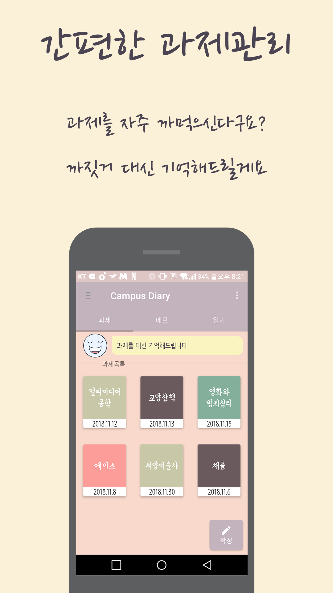
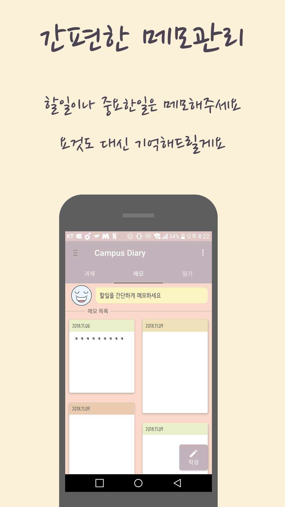
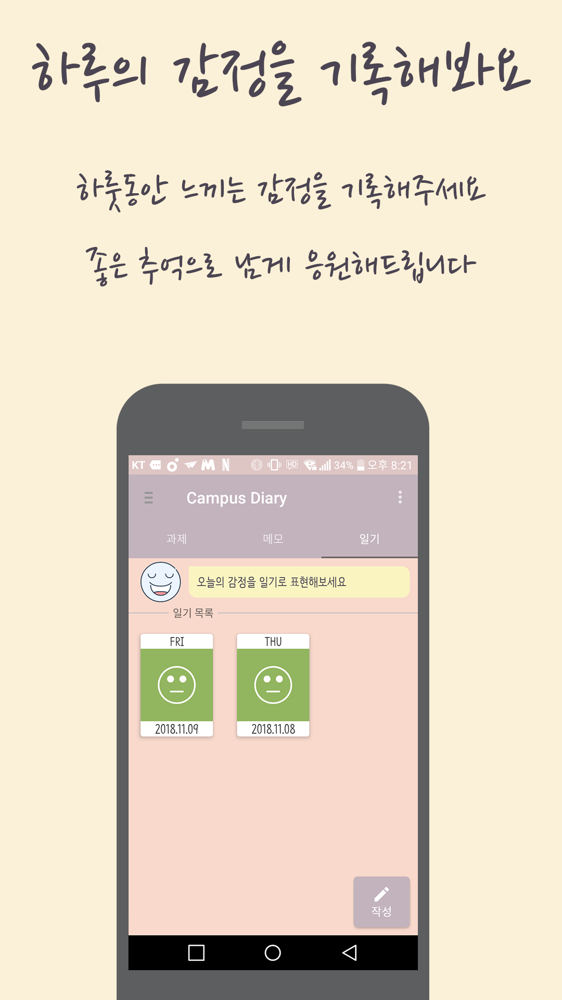
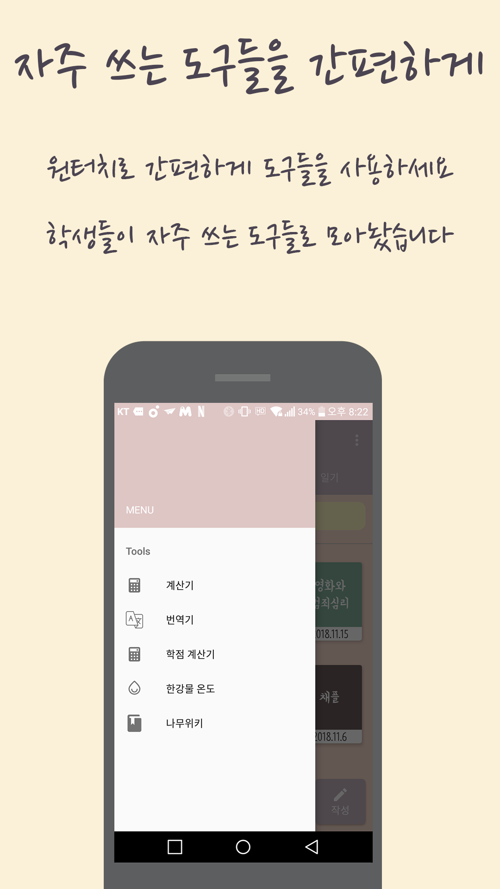

# CampusDiary-Android

앱 이름 : 캠퍼스 다이어리

사용 용도 :  대학생 과제 메모, 할일 메모, 감성일기, 대학생에게 필요한 도구들(계산기, 번역기, 학점계산기 등등)

사용 언어 : java, sqlite

사용 IDE : android studio

---

## How to Use?

(구글 광고id는 테스트용id입니당^^)
